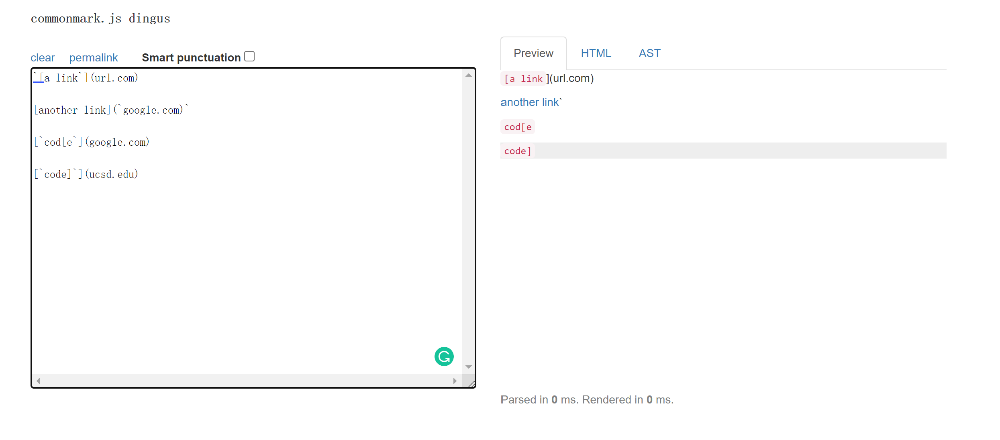
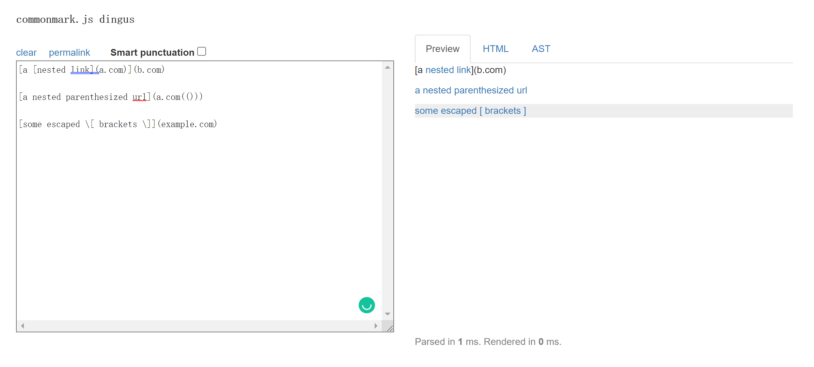
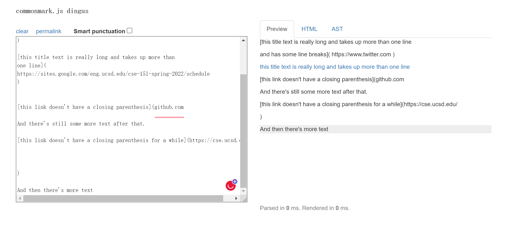

# Welcome to Anthony's Lab Report 4

In this report, I would like to show you testing 3 snippet on my own implementation of markdown-parse and the implementation reviewed in lab 7.

---

[**Link to my own markdown-parse repo**](https://github.com/Ayditore/markdown-parser)  

[**Link to lab 7 reviewed markdown-parse repo**](https://github.com/NuojinliXu/markdown-parser)  

---

## Snippet 1 Preview using the CommonMark demo site  

## Snippet 2 Preview using the CommonMark demo site  

## Snippet 3 Preview using the CommonMark demo site  

---

## My code in MarkdownParseTest.java showing how I write tests

* Test for Snippet 1

* Test fpr snippet 2

* Test for snippet 3

## Result running Junit Test using my implementation of markdown parse

* Snippet 1 Result  

    Passed? 

* Snippet 2 Result  

    Passed? 

* Snippet 3 Result  

    Passed? 

## Result running Junit Test using lab 7 reviewed of markdown parse

* Snippet 1 Result  

    Passed? 

* Snippet 2 Result  

    Passed? 

* Snippet 3 Result  

    Passed? 

---

## Question and Answers

**_Questions: Do you think there is a small (<10 lines) code change that will make your program work for snippet 1/2/3 and all related cases that use inline code with backticks? If yes, describe the code change. If not, describe why it would be a more involved change._**

* Answer to Snippet 1 test with my own implementation of markdown-parse  

    Ans:

* Answer to Snippet 2 test with my own implementation of markdown-parse 

    Ans:

* Answer to Snippet 3 test with my own implementation of markdown-parse 

    Ans:
