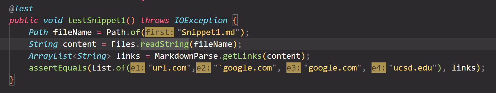
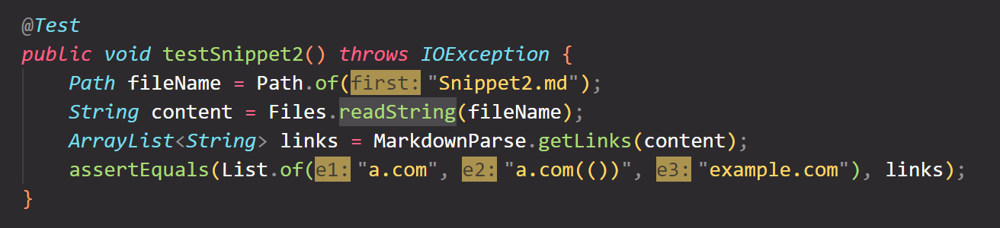
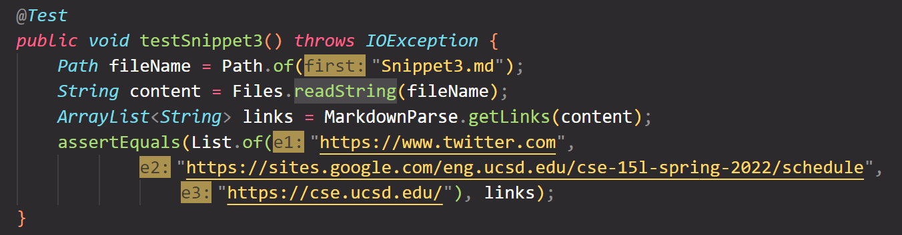
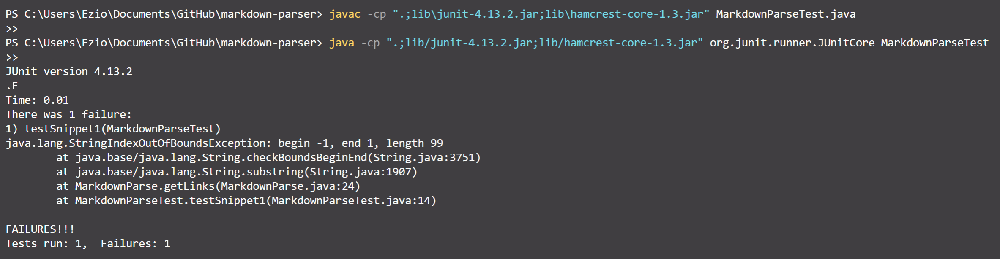
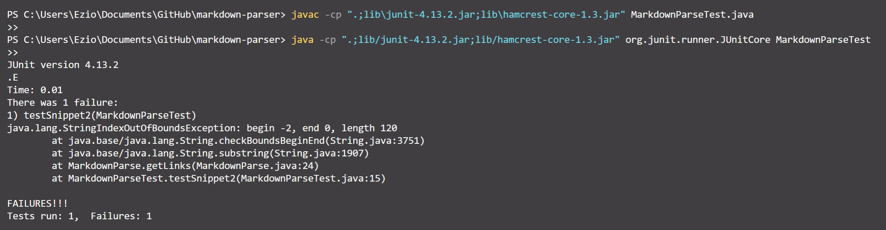
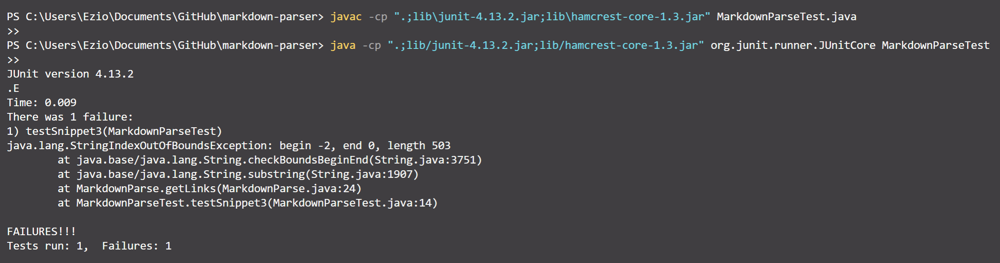
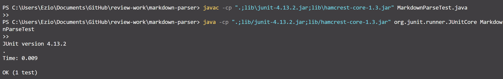
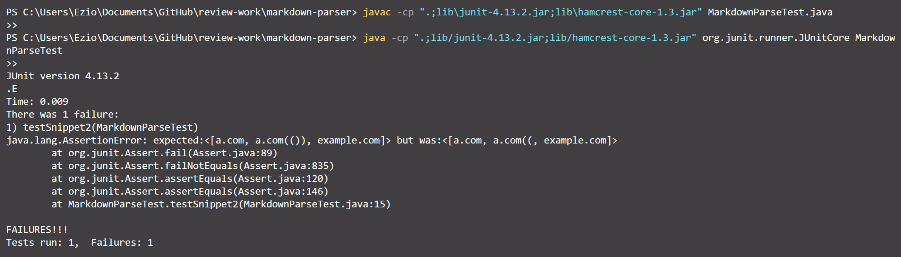
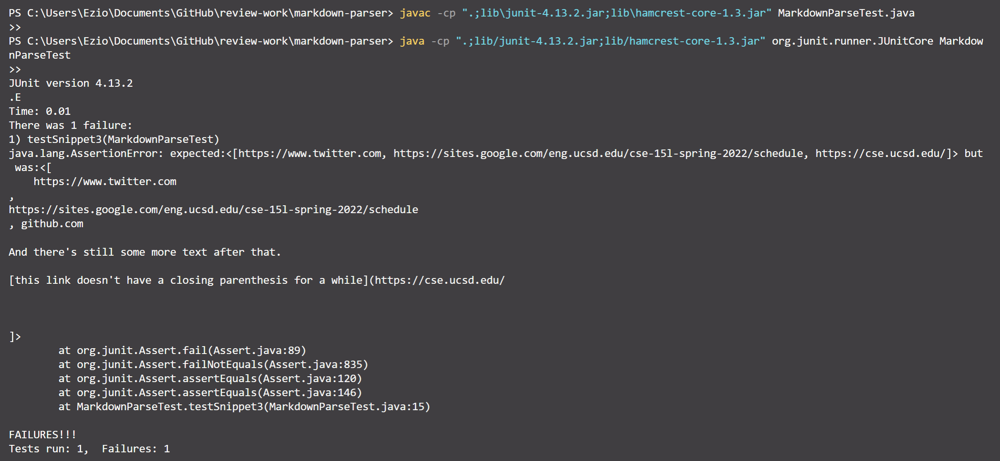

# Welcome to Anthony's Lab Report 4

In this report, I would like to show you testing 3 snippet on my own implementation of markdown-parse and the implementation reviewed in lab 7.

---

[**Link to my own markdown-parse repo**](https://github.com/Ayditore/markdown-parser)  

[**Link to lab 7 reviewed markdown-parse repo**](https://github.com/NuojinliXu/markdown-parser)  

---

## Snippet 1 Preview using the CommonMark demo site  

    Thus, the expected value should be [url.com, `google.com, google.com, ucsd.edu]

## Snippet 2 Preview using the CommonMark demo site  

    Thus, the expected value should be [a.com, a.com(()), example.com]

## Snippet 3 Preview using the CommonMark demo site  

    Thus, the expected value should be [https://www.twitter.com, https://sites.google.com/eng.ucsd.edu/cse-15l-spring-2022/schedule, https://cse.ucsd.edu/]

---

## My code in MarkdownParseTest.java showing how I write tests based on preview

* Test for Snippet 1  
  

* Test fpr snippet 2  

  

* Test for snippet 3  
  

## Result running Junit Test using my implementation of markdown parse

* Snippet 1 Result  

    Passed? No. It failed because a index out of bound exception.

* Snippet 2 Result  

    Passed? No. It failed because a index out of bound exception.

* Snippet 3 Result  

    Passed? No. It failed because a index out of bound exception.

## Result running Junit Test using lab 7 reviewed of markdown parse

* Snippet 1 Result  

    Passed? Yes. After running the test using my peer's program. The test passed.

* Snippet 2 Result  

    Passed? No. The expected value is different because it should be `a.com(())` but it produces `a.com((`

* Snippet 3 Result  

    Passed? No. The expected list of url is in one line while the actual output is in several lines.

---

## Question and Answers

**_Questions: Do you think there is a small (<10 lines) code change that will make your program work for snippet 1/2/3 and all related cases that use inline code with backticks? If yes, describe the code change. If not, describe why it would be a more involved change._**

* Answer to Snippet 1 test with my own implementation of markdown-parse  

    Ans: My program failed the test because of a out of cound exception occured when running my code. After comparing my code my my peer's code, I found that he used more statement to check if the index is valid. I think I could fix this problem after adding those statements.

* Answer to Snippet 2 test with my own implementation of markdown-parse 

    Ans: The program also failed in the test due to the out of bound statement. However, I think fixing this second snippet needs more than 10 lines code change for me. Firstly, I need to fix the index out of bounds issue. Then, based on my peer's code and result, I think I need to reevaluate the condition I used to check the opening and closing parenthesis. I think these two steps might take more than 10 lines.

* Answer to Snippet 3 test with my own implementation of markdown-parse 

    Ans: The test failed again caused by the index of of bounds issue existed in test 1 and test 2. I think this index out of bounds issue is a structural issue that must be fixed. Then, according to the result of my peer's work, I think fixing this problem might need more than 10 lines for me. Firstly, I need to reevaluate the condition I used to substring the test from content. Then, I need to rewrite the statements I used for getting the index of opening and closing of both  parenthesis and brackets.